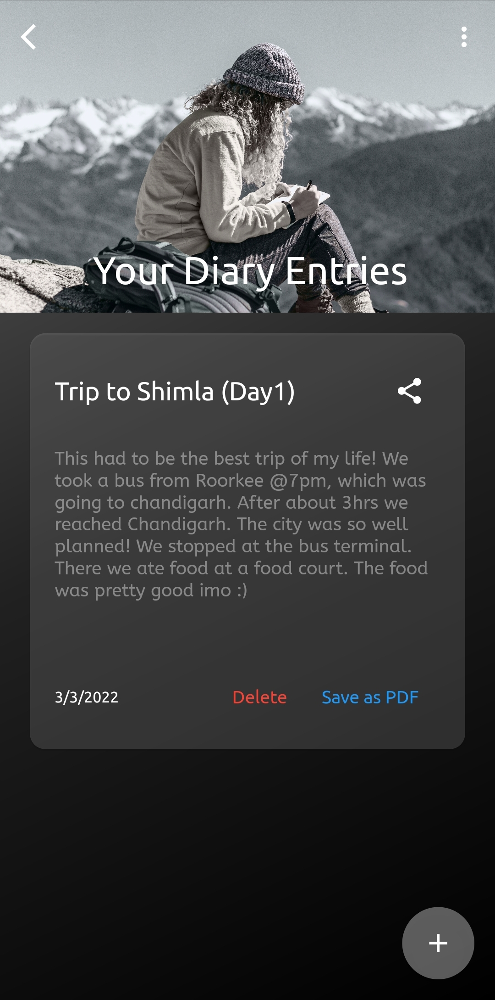
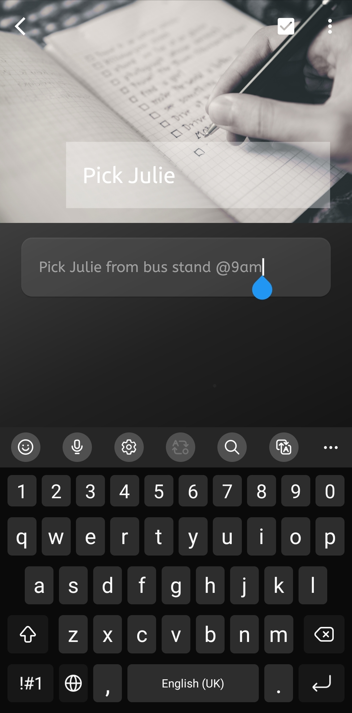
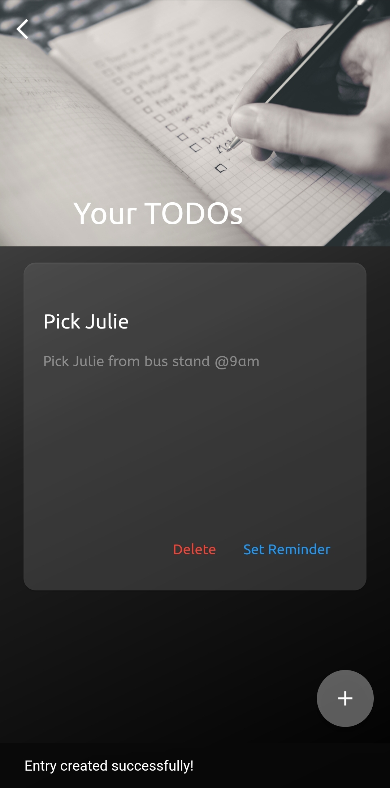
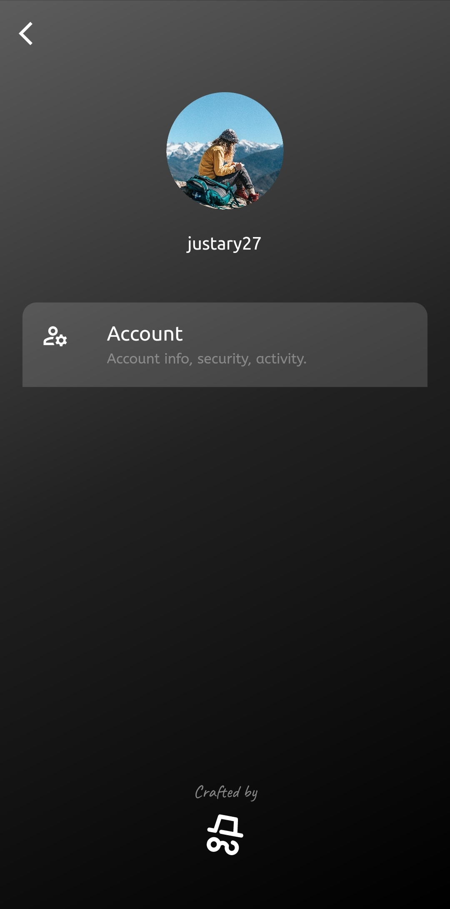

     
    <h1>Lyf</h1>

`“Life, optimized.”`

     &emsp;
     &emsp;
     &emsp;
     &emsp;
    <!--  &emsp; -->
    <!--  &emsp; -->

 

One app for your daily _**lyf**_ activities. Easy to use app to perform daily activities like recording diaries, making TODO(s) in an elegant way.
<!-- and also record your health stats -->
 

## Beautiful UI
Tired of experiencing the 2013s cluttered UI of the present TODO/Diary Apps? Well no more! _**lyf**_ offers a dynamic UI which is modern, easy to use and aesthetically pleasing!

 

## TODOs
Make TODOs so that you never loose task of an upcoming task! Just hit the tick button and you are set!

 

## Diary
Are you also one of those, who like to keep their best experiences captured in a diary for the days to come? If yes, then we have someting for you too! Effortlessly write a diary and save it on the click of a button. 
 
Not enough? You can also effortlessly save your memories as a Pdf file, if you want that "book" feel!

 

### Download the app and _**start writing your lyf!**_

**More features coming soon!** 

Got ideas to improve the app? Contact us at thelyfApp@gmail.com.
 

### Tech Stack
- Flutter 
- Django
- Django Rest FrameWork
- Report Lab
- Heroku 
- Firebase

 
 

    

    
Made with ❤️ by
        
    

